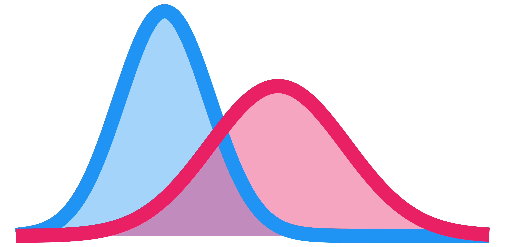
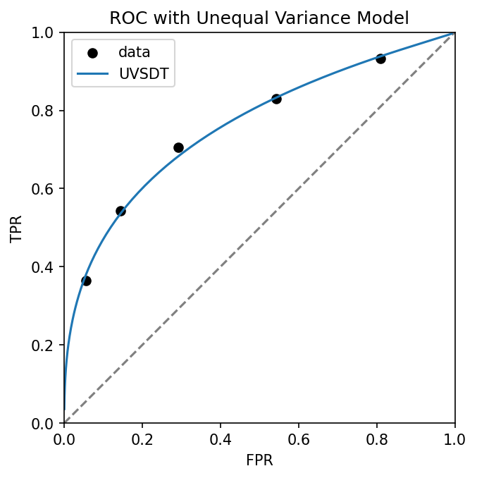

# Home



**Kriterion** is a Python library for analysing data using [signal detection theory](https://en.wikipedia.org/wiki/Detection_theory).

Key features:

- Compute sensitivity and bias measures: $d'$, $c$ and more
- Fit detection models to ROC data
- Assess model fits

## Installation

It is recommend to use a virtual environment when installing python packages ([see here](https://packaging.python.org/en/latest/guides/installing-using-pip-and-virtual-environments/)). Then:

```sh
python -m pip install kriterion
```

## Dependencies

- NumPy
- SciPy

## Usage

Check [the docs](./docs/) for more details.

### Example 1: Basic signal detection theory measures

With a single true positive and false positive rate, return all common detection measures:

```python
from kriterion.measures import compute_performance


result = compute_performance(tpr=0.75, fpr=0.21)
print(result)
```

```python title="Out"
Performance(
    tpr=0.75,
    fpr=0.21,
    d_prime=1.480910997214322,
    a_prime=0.850886075949367,
    c_bias=0.06596574841107933,
    beta=1.1026202605581668,
    a_z=None
)
```

### Example 2: Receiver operating characteristic (ROC) modelling

Given a set of rating-scale responses to signal and noise trials:

```python
from kriterion.data import ROCData
from kriterion.fit import fit
from kriterion.models import  UnequalSignalDetection


data = ROCData(
    # Strongest "signal" <---> Strongest "noise"
    # All responses to signal-present trials
    signal=[505, 248, 226, 172, 144, 93],
    # All responses to signal-absent (i.e. noise) trials
    noise=[115, 185, 304, 523, 551, 397],
)

uvsdt = UnequalSignalDetection(data)

result = fit(uvsdt)
```

```python title="Out"
print(uvsdt.parameters)
{
    'd': 1.1830254066861041,
    'signal_sd': 1.337287925732202,
    'c0': 1.0405303717702958,
    'c1': 0.46634923592441596,
    'c2': -0.06932116955166004,
    'c3': -0.6973808897916125,
    'c4': -1.4561271120010804
}

print(result)
ModelSummary(
    dof=3,
    chi2=9.183606301259807,
    chi2_p=0.02694676677704899,
    g2=9.305614752213955,
    g2_p=0.02549179488508846,
    log_likelihood=-5761.067476662813,
    aic=11536.134953325625,
    bic=11579.184187136441,
    sse=0.0004422615018773785
)
```



## License

This project is licensed under the terms of the GPL-3.0 license.
